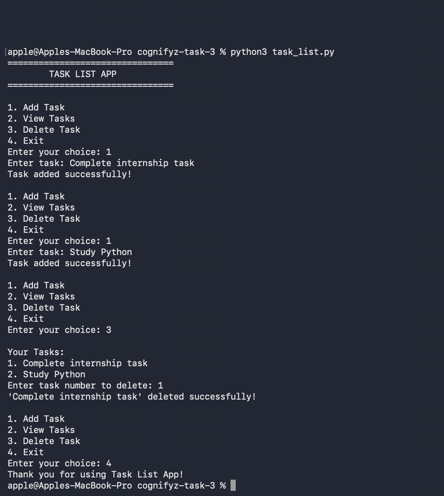

# Cognifyz Task 3 - Task List App

## Description

A simple Task List application developed in Python as part of the Cognifyz Software Development Internship.

## Features

- Add new tasks
- View all tasks
- Delete tasks
- Exit the application
- Simple menu-based interface

## Technologies Used

- Python

## Sample Output

